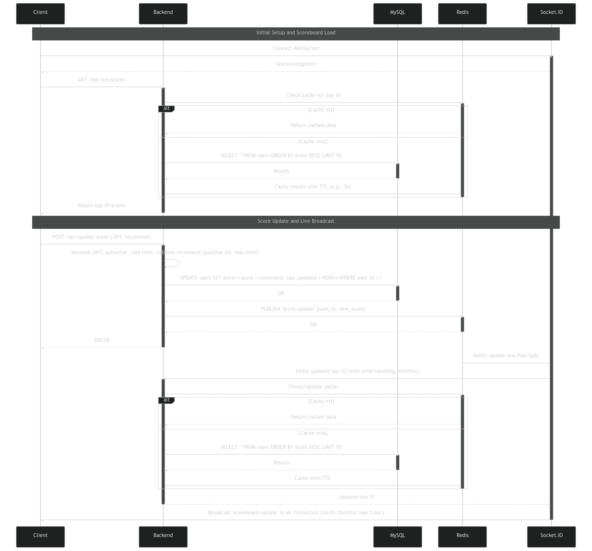

# Software Requirement Specification

<details>
  <summary>Table of Contents</summary>
  <ol>
    <li>
      <a href="#requirement-recap">Requirement Recap</a>
    </li>
    <li>
      <a href="#tech-stack">Tech Stack</a>
    </li>
    <li>
      <a href="#solution-design">Solution Design</a>    
  </ol>
</details>

## [Requirement Recap](#requirement-recap)

1. **Scoreboard**: Display top 10 users’ scores on a website.
2. **Live Updates**: Scoreboard updates in real-time as scores change.
3. **User Action**: Completing an action increments a user’s score (action details unspecified).
4. **API Call**: Action completion triggers an API call to update the score on the server.
5. **Security**: Prevent unauthorized score increases by malicious users.

## [Tech Stack](#tech-stack)

- **Backend**: NodeJS with Express (API server, integrates with database).
- **Database**: Redis, MySQL (stores user scores securely).
- **Real-Time**: WebSockets (e.g., Socket.IO) for live updates.
- **Security**: JWT (JSON Web Tokens) for authentication/authorization.

## [Solution Design](#solution-design)

1. **Database Design**

- Create user table
  ```sh
  CREATE TABLE users (
      user_id INT PRIMARY KEY AUTO_INCREMENT,
      username VARCHAR(50) UNIQUE NOT NULL,
      last_updated datetime(6) NOT NULL DEFAULT CURRENT_TIMESTAMP(6),
      score INT DEFAULT 0
  );
  ```
  - Improvement comments:
    - Create Index score for faster sorting

2. **Scoreboard** (Top 10 users)

- An API endpoint retrieves the top 10 users from the database
  ```sh
  GET /api/top-scores
  ```
  - Improvement comments:
    - Cache results in Redis with a TTL (e.g., 5 seconds) to reduce database load

3. **Live Updates**

- Use WebSockets (Socket.IO) to push score updates to all connected clients in real-time.
  - Improvement comments:
    - Use a dedicated event queue (e.g., Redis Pub/Sub) to decouple score updates from Socket.IO, improving scalability.
    - Add error handling in broadcastScores (e.g., log failures, retry logic).
    - Throttle broadcasts (e.g., max 1/sec) to avoid flooding clients during rapid updates.

4. **API Call**

- API endpoint increments the user’s score and triggers a live update.
  ```sh
  POST /api/update-score
  ```
  - Improvement comments:
    - Validate increment (e.g., positive integer, max limit) to prevent abuse.

5. **Prevent Malicious Updates**

- Authentication: Use JWT to verify user identity.
- Authorization: Ensure only authorized users can update their own scores.
- Rate Limiting: Prevent abuse (e.g., spamming the API).

6. **Diagram to illustrate the flow of execution**
   
